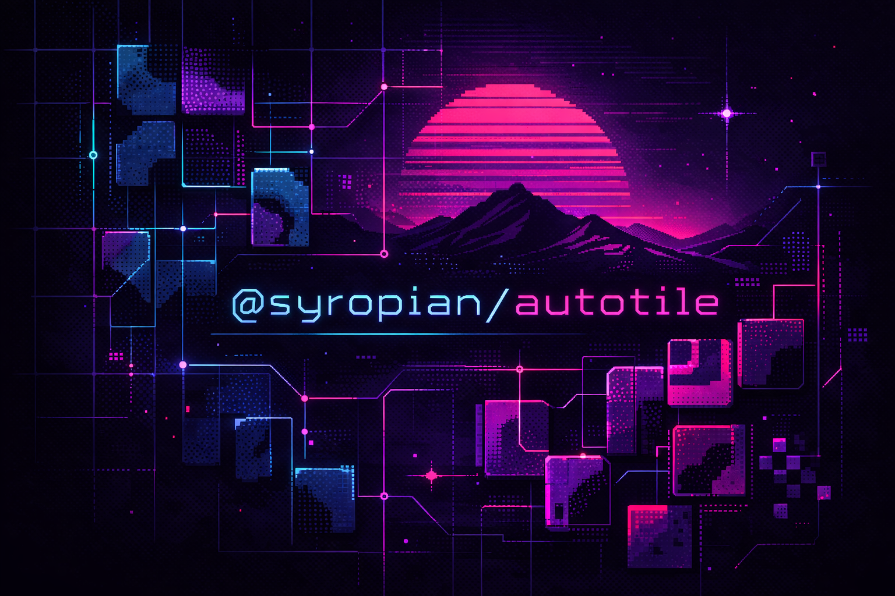

<div align="center">



**Framework-agnostic bitmask autotiling for grid-based maps**

Roads, pipes, and paths snap together automatically without locking you to a
renderer, engine, or editor.

[Install](#install) • [Basic usage](#basic-usage) • [Four-way helpers](#built-in-four-way-helpers) • [Vue example](#vue-example)

</div>

## At a glance

| What it gives you           | Why it matters                                                  |
| --------------------------- | --------------------------------------------------------------- |
| `autotile(...)`             | Resolve tile pieces from neighbor connectivity                  |
| `autotilePathEntities(...)` | Apply a ready-made four-way path profile to map entities        |
| Validation helpers          | Catch missing or duplicate theme pieces before runtime          |
| Debug helpers               | Inspect masks and understand why a tile resolved the way it did |

## Install

Pick your package manager:

```sh
pnpm add @syropian/autotile
```

```sh
npm install @syropian/autotile
```

```sh
yarn add @syropian/autotile
```

```sh
bun add @syropian/autotile
```

## Basic usage

Give the library your tile list and it will figure out which piece each tile
should become based on its neighbors.

```ts
import { autotile } from '@syropian/autotile/core/autotile'
import {
  pathFourWayDirections,
  pathFourWayRuleSet,
} from '@syropian/autotile/profiles/path-fourWay'

const resolved = autotile(tiles, {
  directions: pathFourWayDirections,
  ruleSet: pathFourWayRuleSet,
})
```

Each result includes:

- the resolved `tile`
- the computed neighbor `mask`
- the resolved `piece`
- the `isFlipped` flag
- a `changed` boolean

## Tile shape

Each tile needs an `id`, a grid `position` like `[x, y]`, and a `pathType`
such as `road` or `river`.

`currentPiece` and `isFlipped` are optional, and are mainly useful if you want
to preserve or compare an existing resolved state.

```ts
const tiles = [
  {
    id: 'road-1',
    position: [4, 7],
    pathType: 'road',
  },
]
```

`autotile(...)` only cares about:

- `position`
- `pathType`
- optional `currentPiece`
- optional `isFlipped`

That makes it easy to adapt to your own sprite system, entity model, or map
editor pipeline.

## Built-in four-way helpers

If you want a solid starting point for roads or paths, the built-in four-way
profile gives you a ready-made setup.

> This is the fastest path from raw map data to working connected road pieces.

```ts
import { autotilePathEntities } from '@syropian/autotile/profiles/path-fourWay'

const nextEntities = autotilePathEntities(mapEntities, themeEntities)
```

The exported four-way helpers are:

- `pathFourWayDirections`
- `pathFourWayRuleSet`
- `pathFourWayProfile`
- `autotilePathEntities(...)`

`mapEntities` is your placed map data. `themeEntities` is the list of pieces
the helper can swap in, like straights, corners, caps, and intersections.

```ts
const mapEntities = [
  {
    id: 'map-1',
    vector: [4, 7],
    isFlipped: false,
    updatedAt: '0',
    entity: {
      id: 'road-straight',
      pathType: 'road',
      pathPiece: 'straight',
    },
  },
]

const themeEntities = [
  {
    id: 'road-turn-1',
    pathType: 'road',
    pathPiece: 'turn-1',
  },
]
```

The profile includes:

- a north/east/south/west bitmask layout
- mask-to-piece resolution rules
- theme-aware entity remapping
- immutable output, even when nothing changes

## Real game example

If you want to see this style of autotiling in an actual shipped project, take
a look at [Townarama](https://townarama.syropia.net), an isometric city builder
made with Vue 3.

It is a useful reference for how this package can fit into a larger game/editor
pipeline instead of staying as an isolated demo.

## Custom profiles

You can skip the built-in four-way setup and pass your own directions and rule
set into `autotile(...)`.

<details>
<summary>Example custom profile</summary>

```ts
const directions = [
  { name: 'north', dx: 0, dy: -1, bit: 1 },
  { name: 'east', dx: 1, dy: 0, bit: 2 },
  { name: 'south', dx: 0, dy: 1, bit: 4 },
  { name: 'west', dx: -1, dy: 0, bit: 8 },
]

const ruleSet = {
  5: { piece: 'straight', flip: false },
  10: { piece: 'straight', flip: true },
}
```

</details>

You can also define the rule set with the exported type:

```ts
import type { AutotileRuleSet } from '@syropian/autotile/core/types'

const rules: AutotileRuleSet<'straight' | 'corner'> = {
  0: { piece: 'straight', flip: false },
  3: { piece: 'corner', flip: false },
}
```

Pair that with custom `directions`, `groupBy`, or `keyFn` logic to fit your
own grid conventions.

## Reference helpers

Once the main flow is working, these helpers cover validation and debugging.

## Validation helpers

Use `validatePathSet(...)` to check that a theme includes the required path
pieces and does not contain duplicate definitions.

- `validatePathSet(entities)` checks required pieces, duplicates, and unknown
  pieces

## Debug helpers

Use the debug helpers when you need to inspect a tileset or understand why a
mask resolved a certain way.

- `buildMaskLookup(tiles, options)` returns per-position masks
- `explainMask(mask, directions, ruleSet)` explains active directions and the
  resolved piece

## Behavior guarantees

- Immutable output: input tiles and map entities are never mutated
- Deterministic order: output order matches input order unless items are
  explicitly dropped
- Efficient lookups: per-group `Set<string>` occupancy tables keep resolution
  predictable at `O(n)` setup and `O(n)` resolve

## Scripts

Library build:

```sh
pnpm build
```

Example app:

```sh
pnpm dev
```

Type-check the Vue example:

```sh
pnpm typecheck:example
```

Build the static example bundle:

```sh
pnpm build:example
```

Test:

```sh
pnpm test
```

Coverage:

```sh
pnpm test:coverage
```

## Vue example

A minimal Vue 3 + Vite demo lives in [`examples/`](./examples). The Vite config
stays at the repo root in [`vite.config.ts`](./vite.config.ts), and the dev
server resolves `@syropian/autotile/*` imports back to the local `src/` files
so you can iterate on the library and the browser demo together.

`pnpm build:example` outputs a static site into `example-dist/`, which is
suitable for standard static hosts such as Cloudflare Pages or Netlify.
